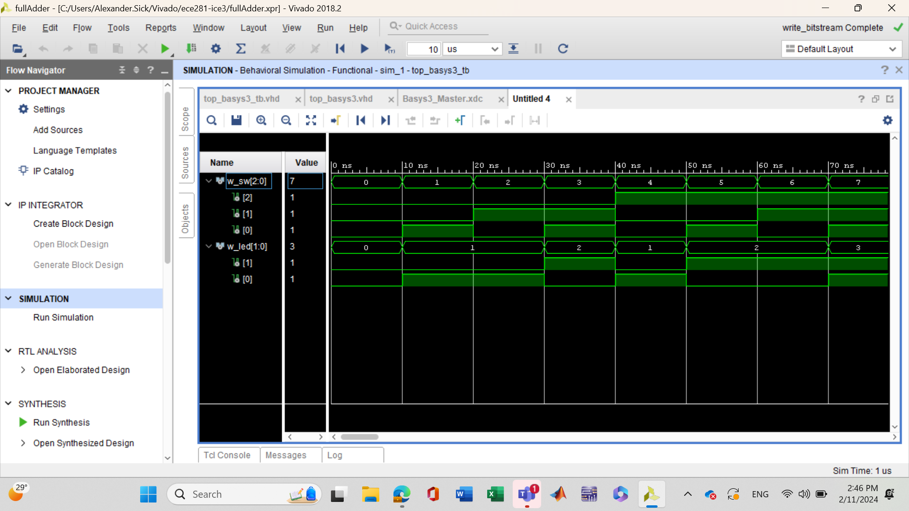

# ECE 281 ICE 3: FullAdder with Top Level Design

**Fork** this repo.

[ICE 3 instructions](https://usafa-ece.github.io/ece281-book/ICE/ICE3.html)

Targeted toward Digilent Basys3. Make sure to install the [board files](https://github.com/Xilinx/XilinxBoardStore/tree/2018.2/boards/Digilent/basys3).

Tested on Vivado 2018.2.

---

## GitHub Actions Testbench

You can *optionally* enable Actions on your fork.

The workflow uses the [setup-ghdl-ci](https://github.com/ghdl/setup-ghdl-ci) GitHub action
to run a *nightly* build of [GHDL](https://ghdl.github.io/ghdl/).

First, the workflow uses GHDL to **analyze** all `.vhd` files in `src/hdl/`.

Then it **elaborates** the *any* entity with the name `*_tb`.

Finally, the workflow **runs** the simulation. If successful then it will quietly exit with a `0` code.
If any of the `assert` statements fail **with** `severity failure` then GHDL will cease the simulation and exit with non-zero code; this will also cause the workflow to fail.
Assert statements of other severity levels will be reported, but not fail the workflow.

## Documentation

For this assignment, I worked with C3C John Costello and C3C Jake Miller. We worked on how to properly assign the ports of the top_basys3 VHD file. Our waveforms were not working properly
even though we thought the tb files were correctly written, and Jake's teacher helped us realize that we had not included the VHD files in the tb simulation folders. I also did basic Google searches for
correct syntax of assigning signals.
